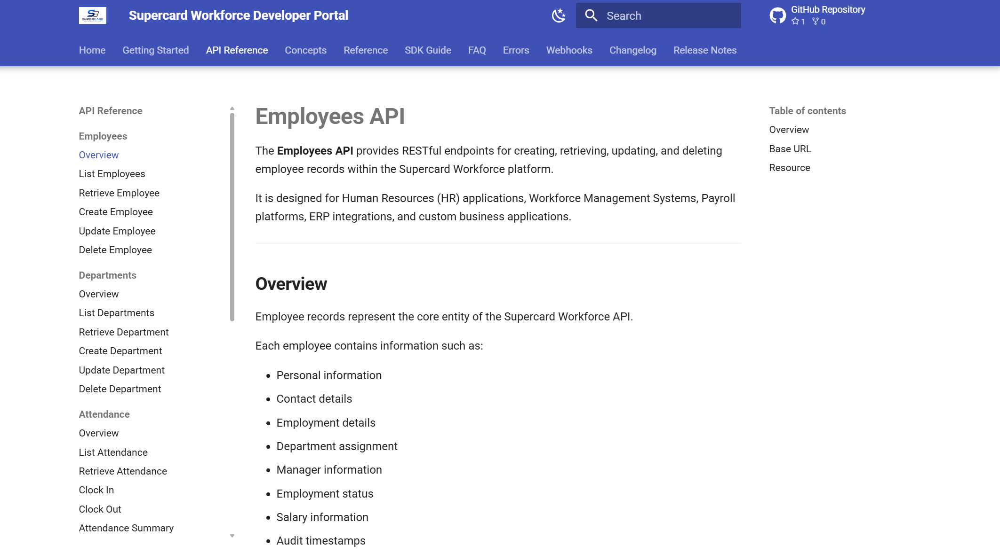
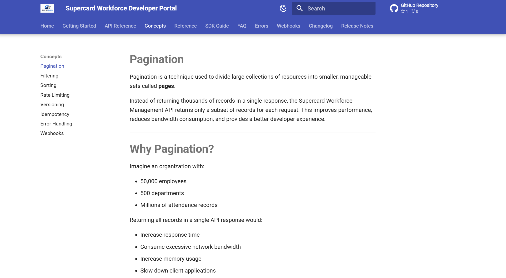

# 🚀 Supercard Workforce Developer Portal

A modern, enterprise-style API documentation portal for the **Supercard Workforce Management API**, built using **OpenAPI 3.0**, **MkDocs Material**, and **Redocly**.

This project demonstrates how to design, document, validate, and publish production-quality REST APIs using industry-standard documentation practices.

---

## 📖 Overview

The Supercard Workforce API enables organizations to integrate workforce management capabilities into custom applications.

The documentation portal includes complete API references, authentication guides, request and response schemas, reusable OpenAPI components, and interactive developer documentation.

---

## ✨ Features

- 📘 OpenAPI 3.0 Specification
- 📚 Modular API Documentation
- 🔐 OAuth 2.0 Bearer Authentication
- 👨‍💼 Employee Management APIs
- 🏢 Department Management APIs
- 🕒 Attendance Management APIs
- 🌴 Leave Management APIs
- 💰 Payroll APIs
- 📊 Reporting APIs
- 🧩 Reusable Schemas & Components
- 📦 Request Bodies & Responses
- 📝 API Examples
- 🚨 Standardized Error Responses
- 🔎 Built-in Search
- 🌙 Responsive Material Design UI
- ⚡ Static Site Generation using MkDocs
- ✅ OpenAPI Validation using Redocly

---

## 🛠️ Tech Stack

| Technology | Purpose |
|------------|---------|
| OpenAPI 3.0 | API Specification |
| YAML | API Definitions |
| MkDocs Material | Documentation Website |
| Redocly CLI | OpenAPI Validation & Bundling |
| Python | Documentation Server |
| Git | Version Control |
| GitHub | Repository Hosting |

---

## 📂 Project Structure

```text
Supercard Workforce Developer Portal
│
├── docs/
│   ├── api-reference/
│   ├── authentication.md
│   ├── errors.md
│   ├── faq.md
│   ├── webhooks.md
│   └── index.md
│
├── openapi/
│   ├── components/
│   │   ├── examples/
│   │   ├── requestBodies/
│   │   ├── schemas/
│   │   ├── parameters.yaml
│   │   ├── responses.yaml
│   │   └── security.yaml
│   │
│   ├── paths/
│   └── openapi.yaml
│
├── mkdocs.yml
├── README.md
└── .gitignore
```

---

## 📑 API Modules

- Employees
- Departments
- Attendance
- Leaves
- Payroll
- Reports

---

## 🔒 Authentication

The API uses **OAuth 2.0 Bearer Token Authentication**.

Example:

```http
Authorization: Bearer YOUR_ACCESS_TOKEN
```

---

## 🚀 Getting Started

### Clone the Repository

```bash
git clone https://github.com/<aloksharma22>/<supercard-workforce-developer-portal>.git
```

### Navigate to the Project

```bash
cd supercard-workforce-developer-portal
```

### Install Dependencies

```bash
pip install mkdocs-material
```

### Start Local Server

```bash
mkdocs serve
```

Visit:

```
http://127.0.0.1:8000
```

---

## 📄 Build Documentation

```bash
mkdocs build
```

The generated documentation will be available inside:

```
site/
```

---

## 🔍 Validate OpenAPI Specification

```bash
redocly lint openapi/openapi.yaml
```

---

## 📷 Screenshots

> Add screenshots of your documentation portal here.

<h3>🏠 Homepage</h3>
<p align="center">
  
</p>

<h3>📖 API Reference</h3>
<p align="center">
  
</p>

<h3>🧠 Concepts</h3>
<p align="center">
  
</p>

---

## 🎯 Learning Objectives

This project demonstrates:

- Modular OpenAPI Design
- Enterprise API Documentation
- REST API Best Practices
- Reusable Components
- Documentation Architecture
- API Validation
- Technical Writing
- Git & GitHub Workflow

---

## 📈 Future Improvements

- Interactive API Console
- SDK Documentation
- Postman Collection Download
- API Changelog
- Versioned Documentation

---

## 👨‍💻 Author

**Alok Sharma**

- GitHub: https://github.com/aloksharma22

---

## 📄 License

This project is licensed under the MIT License.

---

## ⭐ Support

If you found this project useful, consider giving it a ⭐ on GitHub.