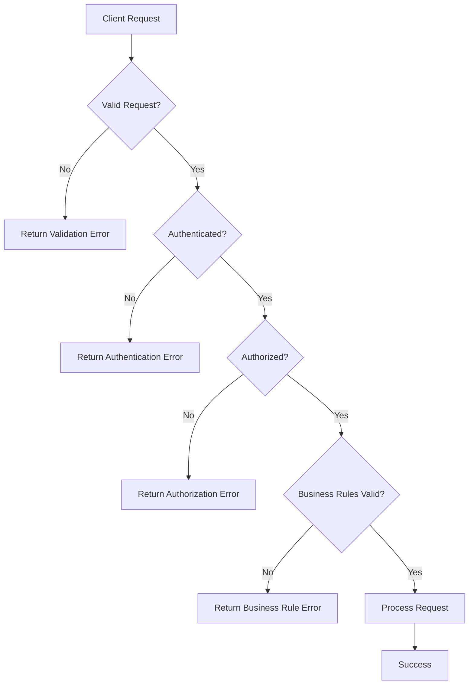

# Error Codes

!!! success "Reference Guide"
    The Supercard Workforce API returns standardized application error codes for every failed request. These codes are stable identifiers intended for programmatic error handling and troubleshooting.

Each error response contains:

- An HTTP status code
- A machine-readable error code
- A human-readable error message
- Request metadata

Applications should rely on `error.code` rather than parsing error messages.

---

# Standard Error Response

```json
{
  "success": false,
  "error": {
    "code": "RESOURCE_NOT_FOUND",
    "message": "The requested employee could not be found."
  },
  "meta": {
    "requestId": "REQ-10001",
    "correlationId": "CORR-7C41A9F3",
    "timestamp": "2025-02-06T14:00:00Z",
    "apiVersion": "v1"
  }
}
```

---

# Error Categories

| Category | Description |
|----------|-------------|
| Validation | Invalid request data |
| Authentication | Invalid or missing credentials |
| Authorization | Insufficient permissions |
| Resource | Missing or duplicate resources |
| Business Rules | Domain-specific validation failures |
| Rate Limiting | Request quota exceeded |
| Server | Unexpected server errors |

---

# Validation Errors

| Error Code | HTTP Status | Description |
|------------|-------------|-------------|
| INVALID_REQUEST | 400 | Request syntax is invalid. |
| INVALID_PARAMETER | 400 | One or more request parameters are invalid. |
| INVALID_FILTER | 400 | Invalid filter parameter supplied. |
| INVALID_SORT_FIELD | 400 | Unsupported sorting field. |
| INVALID_PAGINATION | 400 | Invalid pagination values. |
| VALIDATION_FAILED | 422 | Request validation failed. |
| REQUIRED_FIELD_MISSING | 422 | Required field is missing. |
| INVALID_DATE_RANGE | 422 | The specified date range is invalid. |

---

# Authentication Errors

| Error Code | HTTP Status | Description |
|------------|-------------|-------------|
| AUTHENTICATION_FAILED | 401 | Authentication credentials are invalid. |
| ACCESS_TOKEN_EXPIRED | 401 | Access token has expired. |
| INVALID_ACCESS_TOKEN | 401 | Access token is invalid. |
| MISSING_ACCESS_TOKEN | 401 | Access token is missing. |

---

# Authorization Errors

| Error Code | HTTP Status | Description |
|------------|-------------|-------------|
| ACCESS_DENIED | 403 | Insufficient permissions. |
| INSUFFICIENT_ROLE | 403 | User role cannot perform this action. |
| ORGANIZATION_ACCESS_DENIED | 403 | Access outside organization scope is not permitted. |

---

# Resource Errors

| Error Code | HTTP Status | Description |
|------------|-------------|-------------|
| RESOURCE_NOT_FOUND | 404 | Requested resource does not exist. |
| EMPLOYEE_NOT_FOUND | 404 | Employee not found. |
| DEPARTMENT_NOT_FOUND | 404 | Department not found. |
| ATTENDANCE_NOT_FOUND | 404 | Attendance record not found. |
| LEAVE_REQUEST_NOT_FOUND | 404 | Leave request not found. |
| PAYROLL_NOT_FOUND | 404 | Payroll record not found. |

---

# Conflict Errors

| Error Code | HTTP Status | Description |
|------------|-------------|-------------|
| DUPLICATE_RESOURCE | 409 | Resource already exists. |
| DUPLICATE_EMAIL | 409 | Employee email already exists. |
| IDEMPOTENCY_CONFLICT | 409 | Idempotency key reused with different request. |
| RESOURCE_ALREADY_EXISTS | 409 | Resource already exists. |

---

# Business Rule Errors

| Error Code | HTTP Status | Description |
|------------|-------------|-------------|
| INSUFFICIENT_LEAVE_BALANCE | 422 | Leave balance is insufficient. |
| INVALID_PAYROLL_PERIOD | 422 | Payroll period is invalid. |
| PAYROLL_ALREADY_GENERATED | 409 | Payroll has already been generated. |
| CLOCK_IN_ALREADY_EXISTS | 409 | Employee has already clocked in. |
| CLOCK_OUT_NOT_ALLOWED | 422 | Clock-out request is not allowed. |
| INVALID_EMPLOYMENT_STATUS | 422 | Employee status is invalid for this operation. |

---

# Report Errors

| Error Code | HTTP Status | Description |
|------------|-------------|-------------|
| REPORT_GENERATION_FAILED | 500 | Report generation failed. |
| REPORT_NOT_FOUND | 404 | Requested report not found. |
| UNSUPPORTED_EXPORT_FORMAT | 422 | Requested export format is not supported. |
| EXPORT_JOB_EXPIRED | 404 | Export job has expired. |

---

# Rate Limiting Errors

| Error Code | HTTP Status | Description |
|------------|-------------|-------------|
| RATE_LIMIT_EXCEEDED | 429 | Request limit exceeded. |

---

# Server Errors

| Error Code | HTTP Status | Description |
|------------|-------------|-------------|
| INTERNAL_SERVER_ERROR | 500 | Unexpected server error. |
| SERVICE_UNAVAILABLE | 503 | Service is temporarily unavailable. |
| DATABASE_ERROR | 500 | Database operation failed. |
| TIMEOUT | 504 | Request timed out. |

---

# Example Validation Error

```json
{
  "success": false,
  "error": {
    "code": "VALIDATION_FAILED",
    "message": "One or more validation errors occurred.",
    "details": [
      {
        "field": "email",
        "message": "A valid email address is required."
      }
    ]
  },
  "meta": {
    "requestId": "REQ-10002",
    "correlationId": "CORR-7C41A9F3",
    "timestamp": "2025-02-06T14:10:00Z",
    "apiVersion": "v1"
  }
}
```

---

# Example Authentication Error

```json
{
  "success": false,
  "error": {
    "code": "ACCESS_TOKEN_EXPIRED",
    "message": "Your access token has expired."
  },
  "meta": {
    "requestId": "REQ-10003",
    "correlationId": "CORR-7C41A9F3",
    "timestamp": "2025-02-06T14:15:00Z",
    "apiVersion": "v1"
  }
}
```

---

# Error Handling Workflow



---

# Best Practices

- Use `error.code` for application logic.
- Display user-friendly error messages in the UI.
- Log `requestId` and `correlationId`.
- Retry only when appropriate.
- Validate user input before sending requests.

---

# Common Mistakes

❌ Parsing the error message instead of using `error.code`.

❌ Ignoring the HTTP status code.

❌ Retrying validation errors.

❌ Displaying internal server errors directly to end users.

---

# Security Considerations

The API never exposes:

- Passwords
- Access tokens
- SQL queries
- Database schemas
- Stack traces
- Internal implementation details

This protects the platform against information disclosure.

---

!!! tip "Build Around Error Codes"

    Error messages may change for clarity or localization, but `error.code` values remain stable and should be used for application logic.

---

!!! note "Consistent Across the API"

    Every endpoint returns errors using the same response structure and standardized error codes described in this reference.

---

!!! warning "Retry Carefully"

    Only retry temporary failures such as `RATE_LIMIT_EXCEEDED` or `SERVICE_UNAVAILABLE`. Validation and authorization errors require corrective action before retrying.

---

# Related References

- [HTTP Status Codes](status-codes.md)
- [Headers](headers.md)
- [Response Format](response-format.md)

---

# Related Concepts

- [Error Handling](../concepts/error-handling.md)
- [Rate Limiting](../concepts/rate-limiting.md)
- [Idempotency](../concepts/idempotency.md)

---

# Next Steps

Learn about the common HTTP request and response headers used throughout the Supercard Workforce API.

➡ **Next:** [Headers](headers.md)