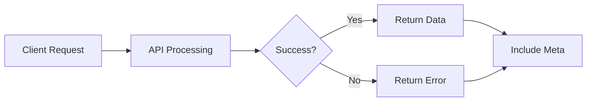

# Response Format

!!! success "Reference Guide"
    The Supercard Workforce API uses a standardized JSON response structure across all endpoints. This consistent format simplifies client development, error handling, and response parsing.

Every API response contains predictable top-level fields, allowing applications to process successful and failed requests using a common model.

---

# Standard Response Structure

All API responses follow this structure.

```json
{
  "success": true,
  "data": {},
  "meta": {}
}
```

For failed requests:

```json
{
  "success": false,
  "error": {},
  "meta": {}
}
```

---

# Response Components

| Field | Required | Description |
|---------|:--------:|-------------|
| success | Yes | Indicates whether the request succeeded. |
| data | Success Only | Contains the requested resource or operation result. |
| error | Error Only | Contains error details for failed requests. |
| meta | Yes | Additional metadata describing the response. |

---

# Successful Response

Example:

```json
{
  "success": true,
  "data": {
    "employeeId": "EMP-1001",
    "employeeName": "Alok Sharma",
    "department": "Engineering"
  },
  "meta": {
    "requestId": "REQ-10101",
    "correlationId": "CORR-7C41A9F3",
    "timestamp": "2025-02-06T15:00:00Z",
    "apiVersion": "v1"
  }
}
```

---

# Successful Response Fields

## success

Boolean value indicating whether the request completed successfully.

Example:

```json
"success": true
```

---

## data

Contains the primary response payload.

Depending on the endpoint, this may contain:

- Employee information
- Attendance records
- Leave requests
- Payroll details
- Report summaries
- Export jobs

Example:

```json
"data": {
  "employeeId": "EMP-1001"
}
```

---

## meta

Provides metadata about the request.

Example:

```json
"meta": {
  "requestId": "REQ-10101",
  "correlationId": "CORR-7C41A9F3",
  "timestamp": "2025-02-06T15:00:00Z",
  "apiVersion": "v1"
}
```

---

# Metadata Fields

| Field | Description |
|---------|-------------|
| requestId | Unique identifier generated by the API. |
| correlationId | Client-generated request identifier. |
| timestamp | UTC time when the response was generated. |
| apiVersion | API version that processed the request. |

---

# Error Response

Failed requests return the following structure.

```json
{
  "success": false,
  "error": {
    "code": "RESOURCE_NOT_FOUND",
    "message": "The requested employee could not be found."
  },
  "meta": {
    "requestId": "REQ-10102",
    "correlationId": "CORR-7C41A9F3",
    "timestamp": "2025-02-06T15:10:00Z",
    "apiVersion": "v1"
  }
}
```

---

# Error Object

| Field | Description |
|---------|-------------|
| code | Machine-readable error identifier. |
| message | Human-readable description of the error. |
| details | Optional validation information. |

---

# Validation Error Example

```json
{
  "success": false,
  "error": {
    "code": "VALIDATION_FAILED",
    "message": "One or more validation errors occurred.",
    "details": [
      {
        "field": "email",
        "message": "A valid email address is required."
      }
    ]
  },
  "meta": {
    "requestId": "REQ-10103",
    "correlationId": "CORR-7C41A9F3",
    "timestamp": "2025-02-06T15:15:00Z",
    "apiVersion": "v1"
  }
}
```

---

# Collection Responses

Endpoints returning multiple resources include a collection inside `data`.

Example:

```json
{
  "success": true,
  "data": {
    "items": [
      {
        "employeeId": "EMP-1001",
        "employeeName": "Alok Sharma"
      },
      {
        "employeeId": "EMP-1002",
        "employeeName": "Priya Shah"
      }
    ],
    "pagination": {
      "page": 1,
      "pageSize": 20,
      "totalRecords": 248,
      "totalPages": 13,
      "hasNext": true,
      "hasPrevious": false
    }
  },
  "meta": {
    "requestId": "REQ-10104",
    "correlationId": "CORR-7C41A9F3",
    "timestamp": "2025-02-06T15:20:00Z",
    "apiVersion": "v1"
  }
}
```

---

# Asynchronous Responses

Long-running operations return a job reference.

Example:

```json
{
  "success": true,
  "data": {
    "reportJobId": "JOB-20250206-001",
    "status": "Queued",
    "estimatedCompletionTime": "2025-02-06T15:30:00Z"
  },
  "meta": {
    "requestId": "REQ-10105",
    "correlationId": "CORR-7C41A9F3",
    "timestamp": "2025-02-06T15:25:00Z",
    "apiVersion": "v1"
  }
}
```

---

# Response Lifecycle



---

# Design Principles

The response format follows these principles:

- Predictable structure
- Consistent naming
- Machine-readable errors
- Human-readable messages
- Standard metadata
- Forward compatibility

---

# Best Practices

- Always inspect the `success` field.
- Check the HTTP status code before processing the body.
- Use `error.code` for application logic.
- Log `requestId` and `correlationId`.
- Process `data` only when `success` is `true`.

---

# Common Mistakes

❌ Assuming `data` always exists.

❌ Parsing error messages instead of `error.code`.

❌ Ignoring the `meta` object.

❌ Using HTTP status codes alone without checking the response body.

---

# Security Considerations

Responses never expose:

- Passwords
- Access tokens
- Internal SQL queries
- Stack traces
- Database connection details

Only information required by the client is returned.

---

!!! tip "Use the Meta Object"

    Store the `requestId` and `correlationId` in your application logs. They make troubleshooting significantly easier.

---

!!! note "Consistent Across Every Endpoint"

    Every endpoint in the Supercard Workforce API follows the response structure documented here, providing a predictable integration experience.

---

!!! warning "Do Not Assume Success"

    Even when a network request completes successfully, always verify both the HTTP status code and the `success` field before processing the response.

---

# Related References

- [HTTP Status Codes](status-codes.md)
- [Error Codes](error-codes.md)
- [Headers](headers.md)
- [Date Formats](date-formats.md)

---

# Related Concepts

- [Error Handling](../concepts/error-handling.md)
- [Pagination](../concepts/pagination.md)
- [Filtering](../concepts/filtering.md)

---

# Next Steps

Learn about the date and time formats used throughout the Supercard Workforce API.

➡ **Next:** [Date Formats](date-formats.md)